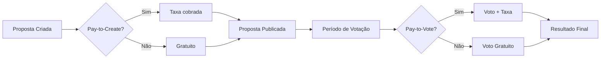

# Hub.org - Visão Geral

> **Sistema leve e self-hosted para transparência financeira e governança de projetos Open Source e ONGs.**

---

## O Que é o Hub.org?

O Hub.org nasceu de uma necessidade real: projetos Open Source e organizações sem fins lucrativos precisam de transparência radical para construir confiança com sua comunidade. Mas as ferramentas existentes são ou complexas demais, ou centralizam dados em plataformas terceiras.

**Hub.org é a resposta anti-social para esse problema.**

Não é uma rede social. Não há feeds, likes, ou "engajamento". É uma ferramenta focada em **três pilares**:

1. **Arrecadação** — Receba doações de forma simples e transparente.
2. **Transparência** — Mostre para onde cada centavo vai.
3. **Governança** — Permita que sua comunidade participe de decisões.

---

## Filosofia "Anti-Social"

Em um mundo saturado de plataformas que competem pela sua atenção, o Hub.org adota uma filosofia radicalmente diferente:

| Princípio                  | Implementação                                                                                   |
| -------------------------- | ----------------------------------------------------------------------------------------------- |
| **Privacidade por Design** | Usuários são identificados apenas por um `@handle` único. Sem nomes reais, sem fotos, sem bios. |
| **Zero Distração**         | Não existe timeline, feed de atividades, ou notificações push.                                  |
| **Foco em Transações**     | A única coisa que importa são: doações, votos, e registros de transparência.                    |
| **Self-Hosted**            | Seus dados ficam no seu servidor. Sempre.                                                       |

---

## Funcionalidades Chave

### 1. Transparência Financeira

```
┌─────────────────────────────────────────────────┐
│           DASHBOARD PÚBLICO                     │
├─────────────────────────────────────────────────┤
│  💰 Arrecadado este mês:     R$ 12.450,00       │
│  📤 Gastos este mês:         R$  8.200,00       │
│  📊 Saldo disponível:        R$  4.250,00       │
├─────────────────────────────────────────────────┤
│  Últimas Transações:                            │
│  ✅ IN   @anonymous_user   +R$ 50,00   há 2h    │
│  ❌ OUT  Servidor AWS      -R$ 150,00  há 1d    │
│  ✅ IN   @dev_contributor  +R$ 200,00  há 3d    │
└─────────────────────────────────────────────────┘
```

- **Entradas (IN):** Todas as doações são registradas publicamente.
- **Saídas (OUT):** Pagamentos de infraestrutura, serviços, e outros gastos são documentados.
- **Metas:** Configure objetivos de arrecadação com barras de progresso visuais.

### 2. Governança Participativa (Votação)

O módulo de votação permite que a comunidade participe de decisões importantes:



- **Pay-to-Create:** Opcionalmente, exija um valor para criar propostas (evita spam).
- **Pay-to-Vote:** Opcionalmente, cobre por voto (peso financeiro nas decisões).
- **Quorum:** Configure número mínimo de votos para validar uma decisão.

### 3. Sistema de @handle

Toda interação no Hub.org é feita através de identificadores únicos:

```
@mantenedor_principal    → Admin do projeto
@doador_anonimo_42       → Usuário que doou
@comunidade_dev          → Membro votante
```

**Benefícios:**

- Privacidade total (nenhum dado pessoal exposto)
- Auditabilidade (todas as ações são rastreáveis pelo handle)
- Simplicidade (sem cadastros complexos)

### 4. Módulos Plugáveis (via JSON)

O Hub.org é modular por natureza. Ative ou desative funcionalidades através do arquivo `modules.json`:

```json
{
  "modules": {
    "donations": {
      "enabled": true,
      "min_amount": 5.0,
      "currency": "BRL"
    },
    "voting": {
      "enabled": true,
      "pay_to_create": 10.0,
      "pay_to_vote": 0
    },
    "audit_log": {
      "enabled": true,
      "public": true
    }
  },
  "landing_page": {
    "sections_order": ["hero", "features", "donate"],
    "sections_data": { ... }
  }
}
```

---

## Casos de Uso

| Tipo de Organização             | Como Usar o Hub.org                                                                     |
| ------------------------------- | --------------------------------------------------------------------------------------- |
| **Projeto Open Source**         | Arrecade para pagar servidores, domínios, e contribuidores. Mostre onde o dinheiro vai. |
| **ONG / Associação**            | Transparência total nas finanças. Permita que membros votem em decisões importantes.    |
| **Comunidade Local**            | Vaquinhas transparentes para eventos, com prestação de contas pública.                  |
| **Coletivo de Desenvolvedores** | Divida custos de infraestrutura e tome decisões democráticas.                           |

---

## Por Que Self-Hosted?

Centralização é o problema. O Hub.org é a solução:

- **Soberania de Dados:** Você controla o servidor, o banco de dados, e os backups.
- **Sem Taxas de Plataforma:** Apenas as taxas do gateway de pagamento (Stripe/PagSeguro).
- **Customização Total:** Modifique o código, adicione módulos, integre com suas ferramentas.
- **Sem Vendor Lock-in:** Migre quando quiser. Seus dados são seus.

---

## Próximos Passos

1. **[Arquitetura e Stack](./02-arquitetura-e-stack.md)** — Entenda as escolhas técnicas.
2. **[Guia de Configuração](./03-guia-de-configuracao.md)** — Configure seu Hub.org.
3. **[Módulos do Sistema](./04-modulos-do-sistema.md)** — Explore cada funcionalidade.
4. **[Banco de Dados](./05-banco-de-dados.md)** — Veja o schema e estrutura de dados.

---

<p align="center">
  <strong>Hub.org</strong> — Transparência radical para projetos que importam.
</p>
