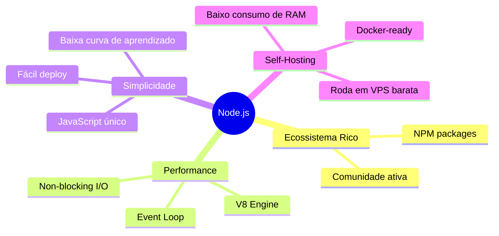
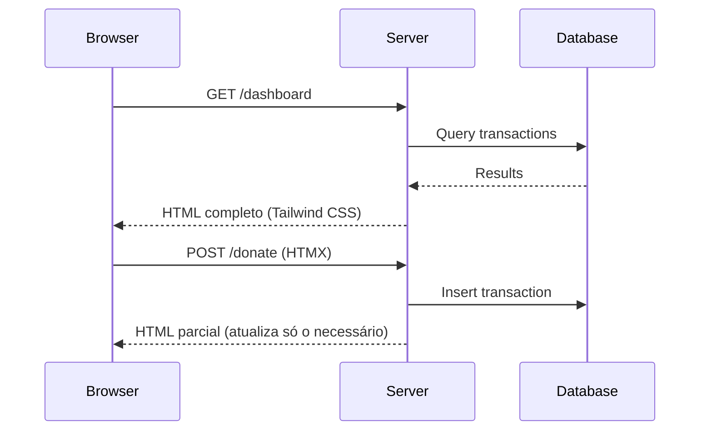
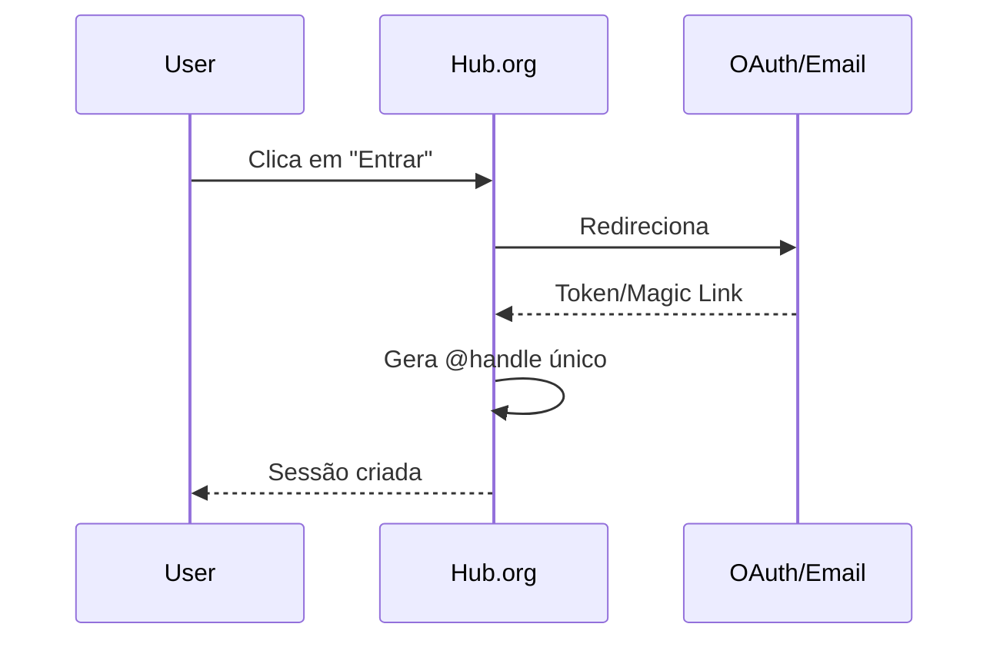
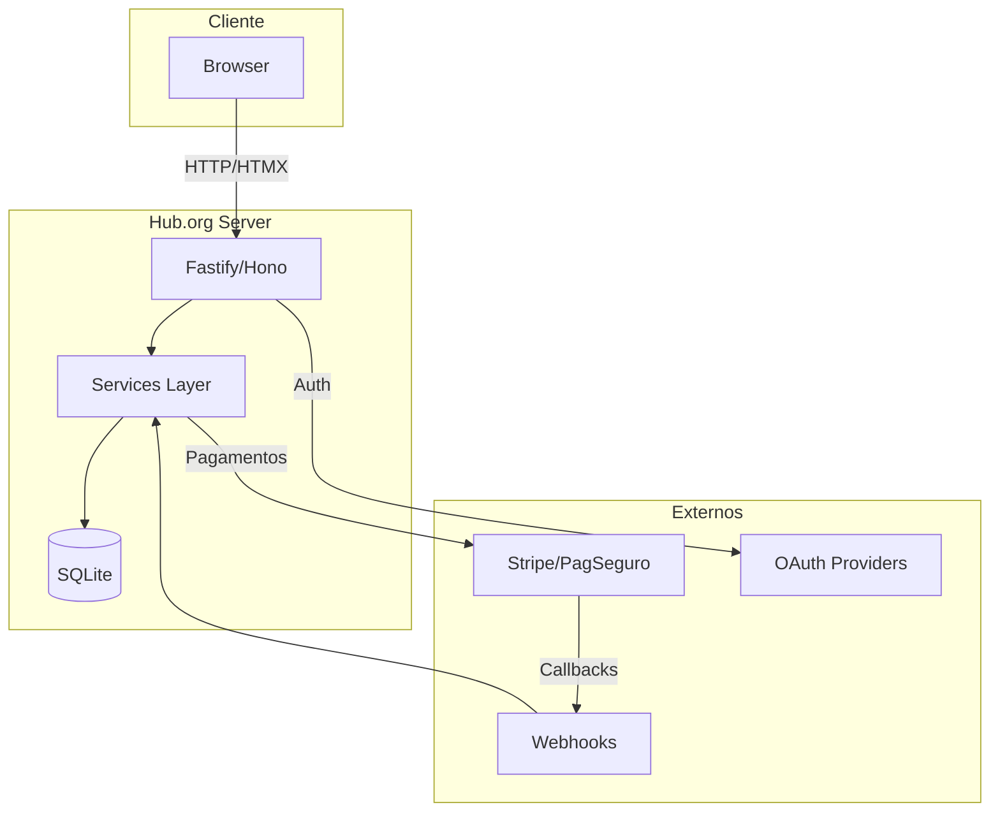

# Arquitetura e Stack Técnica

> **Escolhas técnicas focadas em leveza, portabilidade e simplicidade operacional.**

---

## Stack Tecnológica

### Por Que Node.js?



**Justificativas:**

- **Single-threaded simplificado:** Ideal para aplicações I/O-bound como o Hub.org.
- **Deploy trivial:** Um único comando `npm start` sobe a aplicação.
- **Compatibilidade universal:** Roda em qualquer hosting que suporte Node.js 18+.

### Framework Web: Fastify ou Hono

| Critério        | Fastify          | Hono             |
| --------------- | ---------------- | ---------------- |
| **Performance** | ⭐⭐⭐⭐⭐       | ⭐⭐⭐⭐⭐       |
| **Bundle Size** | ~2MB             | ~500KB           |
| **Ecossistema** | Rico (plugins)   | Minimalista      |
| **Edge Ready**  | Não nativamente  | Sim              |
| **Tipagem**     | TypeScript first | TypeScript first |

**Recomendação padrão:** Fastify para instalações tradicionais (VPS/Docker).  
**Alternativa edge:** Hono para deploy em Cloudflare Workers ou Deno Deploy.

### Banco de Dados: SQLite (Default)

```
┌─────────────────────────────────────────────────┐
│                    SQLite                       │
├─────────────────────────────────────────────────┤
│  ✅ Zero configuração                           │
│  ✅ Arquivo único (.db)                         │
│  ✅ Backup = copiar arquivo                     │
│  ✅ Performance excelente para < 100k usuários  │
│  ✅ Portabilidade total                         │
└─────────────────────────────────────────────────┘
```

**Por que SQLite por padrão?**

- Um projeto Open Source pequeno não precisa de PostgreSQL.
- Backup é literalmente `cp database.db backup.db`.
- Migração para outro banco é suportada via drivers plugáveis.

**Drivers Externos Suportados:**

```javascript
// config/database.js
export const drivers = {
  sqlite: "better-sqlite3", // Default
  postgres: "pg", // Para escala
  mysql: "mysql2", // Legacy support
  libsql: "@libsql/client", // Turso (edge)
};
```

### Frontend: Server-Rendered + HTMX



**Filosofia:**

- **Zero JavaScript no cliente** (ou mínimo via HTMX).
- **Tailwind CSS** para estilização rápida e consistente.
- **Templates server-side** (EJS, Handlebars, ou JSX).

---

## Estrutura de Pastas

```
hub-org/
├── 📁 src/                    # Código fonte principal
│   ├── 📁 routes/             # Definição de rotas (API + páginas)
│   │   ├── api/               # Endpoints JSON
│   │   │   ├── donations.js
│   │   │   ├── votes.js
│   │   │   └── admin.js
│   │   └── pages/             # Rotas que renderizam HTML
│   │       ├── home.js
│   │       ├── dashboard.js
│   │       └── admin.js
│   ├── 📁 services/           # Lógica de negócio
│   │   ├── payment.js         # Integração Stripe/PagSeguro
│   │   ├── voting.js          # Lógica de votação
│   │   └── audit.js           # Sistema de audit log
│   ├── 📁 db/                 # Camada de banco de dados
│   │   ├── schema.sql         # DDL do banco
│   │   ├── migrations/        # Migrações versionadas
│   │   └── queries.js         # Queries preparadas
│   ├── 📁 views/              # Templates HTML
│   │   ├── layouts/           # Layouts base
│   │   ├── partials/          # Componentes reutilizáveis
│   │   └── pages/             # Páginas completas
│   └── 📄 app.js              # Entry point da aplicação
│
├── 📁 modules/                # Módulos plugáveis
│   ├── 📁 cron/               # Automação de pagamentos
│   ├── 📁 webhooks/           # Handlers de webhooks
│   └── 📁 integrations/       # Integrações externas
│
├── 📁 data/                   # Dados persistentes
│   ├── 📄 hub.db              # Banco SQLite (gerado)
│   └── 📁 backups/            # Backups automáticos
│
├── 📁 public/                 # Assets estáticos
│   ├── 📁 css/                # Tailwind compilado
│   ├── 📁 js/                 # HTMX + mínimo JS
│   └── 📁 images/             # Logos, ícones
│
├── 📁 docs/                   # Documentação
│
├── 📄 .env                    # Segredos (NÃO versionar)
├── 📄 .env.example            # Exemplo de variáveis
├── 📄 modules.json            # Configuração de módulos
├── 📄 package.json            # Dependências Node.js
└── 📄 docker-compose.yml      # Deploy via Docker
```

---

## Fluxo de Autenticação

O Hub.org implementa um sistema de autenticação dual, separando claramente administradores de usuários comuns.

```mermaid
flowchart TB
    subgraph Admins ["🔐 Administradores"]
        A1[Email definido no .env]
        A2[ADMIN_EMAILS=admin@org.com]
        A3[Hardcoded por segurança]
    end

    subgraph Users ["👤 Usuários Comuns"]
        U1[OAuth Provider]
        U2[Magic Link]
        U3[Handle gerado automaticamente]
    end

    A1 --> A2 --> A3
    A3 --> AUTH{Autenticação}
    U1 --> AUTH
    U2 --> AUTH
    AUTH --> HANDLE[@handle único]
    HANDLE --> ACCESS[Acesso ao Sistema]
```

### Administradores

**Por que hardcoded no `.env`?**

```bash
# .env
ADMIN_EMAILS="founder@projeto.org,cofounder@projeto.org"
```

- **Segurança:** Nenhum ataque de escalação de privilégios via UI.
- **Simplicidade:** Não precisa de painéis de gerenciamento de roles.
- **Auditabilidade:** Mudanças de admin exigem acesso ao servidor.

**Fluxo de login admin:**

1. Admin acessa `/admin/login`
2. Entra com OAuth (Google/GitHub) ou Magic Link
3. Sistema verifica se email está na lista `ADMIN_EMAILS`
4. Se sim → acesso total ao painel admin
5. Se não → redirecionado como usuário comum

### Usuários Comuns



**Opções de autenticação:**

- **OAuth:** Google, GitHub, Discord (via Passport.js ou similar).
- **Magic Link:** Email com link de login temporário (sem senha).

**Geração de @handle:**

```javascript
// Exemplo de geração
function generateHandle(email) {
  const prefix = email.split("@")[0].slice(0, 8);
  const suffix = crypto.randomBytes(3).toString("hex");
  return `@${prefix}_${suffix}`; // @joao_a3f2c1
}
```

---

## Diagrama de Arquitetura Geral



---

## Considerações de Deploy

### Requisitos Mínimos

| Recurso     | Mínimo | Recomendado |
| ----------- | ------ | ----------- |
| **RAM**     | 256MB  | 512MB       |
| **CPU**     | 1 core | 2 cores     |
| **Disco**   | 1GB    | 5GB         |
| **Node.js** | 18.x   | 20.x LTS    |

### Opções de Hospedagem

```
┌─────────────────────────────────────────────────┐
│  Tier 1: Grátis / Baixo Custo                   │
│  • Railway.app (free tier)                      │
│  • Render.com (free tier)                       │
│  • Fly.io (free tier)                           │
├─────────────────────────────────────────────────┤
│  Tier 2: VPS Tradicional                        │
│  • DigitalOcean Droplet ($4/mês)                │
│  • Linode ($5/mês)                              │
│  • Hetzner ($3/mês)                             │
├─────────────────────────────────────────────────┤
│  Tier 3: Self-Hosted                            │
│  • Raspberry Pi 4                               │
│  • Servidor doméstico                           │
│  • Docker local                                 │
└─────────────────────────────────────────────────┘
```

---

## Próximos Passos

- **[Guia de Configuração](./03-guia-de-configuracao.md)** — Configure `.env` e `modules.json`.
- **[Módulos do Sistema](./04-modulos-do-sistema.md)** — Explore cada funcionalidade em detalhes.
