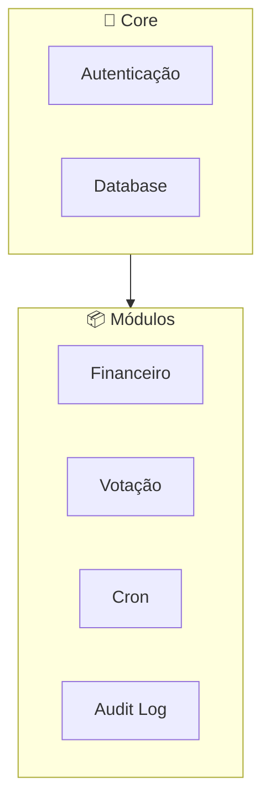
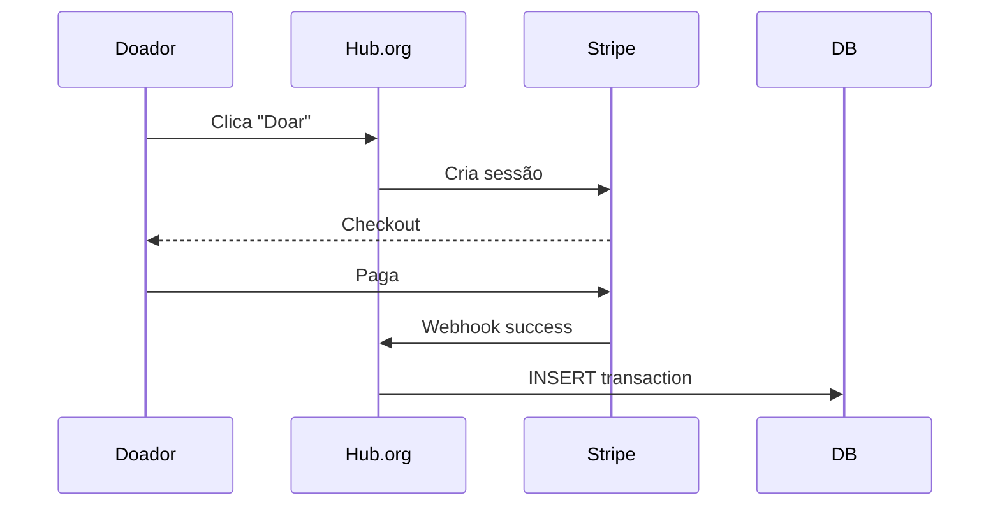
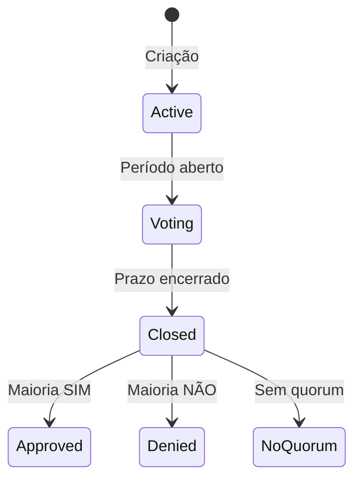
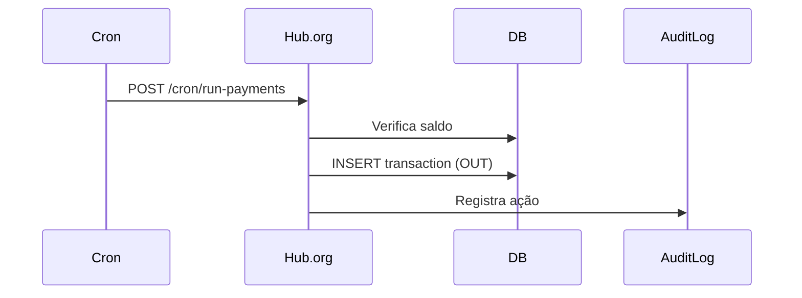
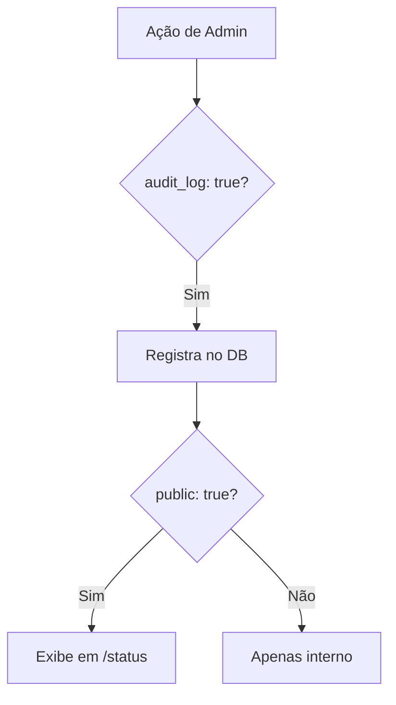

# Módulos do Sistema

> **Cada funcionalidade do Hub.org é um módulo independente e configurável.**

---

## Arquitetura Modular



---

## 1. Módulo Financeiro

Gerencia doações, gastos e metas de arrecadação.

### Fluxo de Doação



### Configurações

| Parâmetro            | Descrição                 |
| -------------------- | ------------------------- |
| `min_amount`         | Valor mínimo de doação    |
| `max_amount`         | Valor máximo              |
| `allow_anonymous`    | Permite doações sem login |
| `goal.enabled`       | Habilita barra de meta    |
| `goal.target_amount` | Valor alvo                |

---

## 2. Módulo de Votação

Permite governança participativa com propostas e votos.

### Ciclo de Vida



### Pay-to-Create

Cria barreira de entrada para evitar spam:

```javascript
if (settings.pay_to_create.enabled) {
  // Cobra taxa para criar proposta
  await chargeCreationFee(userHandle, settings.pay_to_create.amount);
}
```

**Benefícios:**

- Evita spam de propostas
- Demonstra comprometimento
- Gera receita para o projeto

### Pay-to-Vote

Opcionalmente, votar pode ter custo:

```javascript
if (settings.pay_to_vote.enabled) {
  await chargeVotingFee(userHandle, settings.pay_to_vote.amount);
}
```

**Quando usar:**

- DAOs com peso financeiro
- Prevenção de ataques sybil

### Configurações

| Parâmetro              | Descrição                      |
| ---------------------- | ------------------------------ |
| `pay_to_create.amount` | Taxa para criar proposta       |
| `pay_to_vote.amount`   | Taxa para votar (0 = gratuito) |
| `quorum.min_votes`     | Votos mínimos para validar     |
| `duration_days`        | Duração da votação             |

---

## 3. Módulo Cron/Automação

Automatiza pagamentos recorrentes de infraestrutura.

### Fluxo de Pagamento Automático



### Configuração de Pagamentos

```json
{
  "auto_payments": {
    "payments": [
      {
        "id": "hosting",
        "description": "Servidor DigitalOcean",
        "amount": 24.0,
        "currency": "USD",
        "recipient": "DigitalOcean"
      }
    ]
  }
}
```

### Registro Público

Pagamentos automáticos são exibidos com ícone 🤖:

```
📤 Saídas Automáticas - Janeiro 2024
01/01 | Servidor DigitalOcean | -$24.00  🤖
```

---

## 4. Módulo de Transparência (Audit Log)

Registra ações administrativas para auditoria pública.

### Lógica



### Ações Auditáveis

| Ação             | Código               | Descrição                |
| ---------------- | -------------------- | ------------------------ |
| Banir Usuário    | `BAN_USER`           | Admin baniu @handle      |
| Desbanir         | `UNBAN_USER`         | Admin desbaniu @handle   |
| Deletar Proposta | `DELETE_PROPOSAL`    | Admin removeu proposta   |
| Editar Proposta  | `EDIT_PROPOSAL`      | Admin modificou proposta |
| Cancelar Votação | `CANCEL_VOTE`        | Admin cancelou votação   |
| Reembolsar       | `REFUND_TRANSACTION` | Reembolso processado     |
| Alterar Config   | `CHANGE_SETTINGS`    | Config alterada          |

### Página `/status`

Quando `audit_log.public: true`:

```
📋 Log de Transparência

🕐 Hoje, 14:32
  🚫 BAN_USER
  Admin: @mantenedor
  Alvo: @usuario_spam
  Motivo: "Spam repetido"

🕐 Ontem, 09:15
  ⚙️ CHANGE_SETTINGS
  Admin: @fundador
  Alteração: min_donation: 5 → 10
```

### Implementação

```javascript
// src/services/audit.js
async log({ action, adminHandle, target, details }) {
  if (!config.audit_log.enabled) return;
  if (!config.audit_log.actions_to_log.includes(action)) return;

  await db.insert('audit_logs', {
    action,
    admin_handle: adminHandle,
    target,
    details: JSON.stringify(details),
    timestamp: new Date(),
    public: config.audit_log.public
  });
}
```

---

## Gerenciamento de Módulos

### Via `modules.json`

```json
{
  "modules": {
    "donations": { "enabled": true },
    "voting": { "enabled": false },
    "audit_log": { "enabled": true }
  }
}
```

### Via Painel Admin (`/admin/settings`)

```
📦 Gerenciar Módulos

[🟢] Doações       [Configurar]
[⚫] Votação       [Configurar]
[🟢] Audit Log    [Configurar]
[🟢] Cron         [Configurar]

🟢 = Ativo   ⚫ = Inativo
```

---

## Próximos Passos

- **[Banco de Dados](./05-banco-de-dados.md)** — Schema completo
