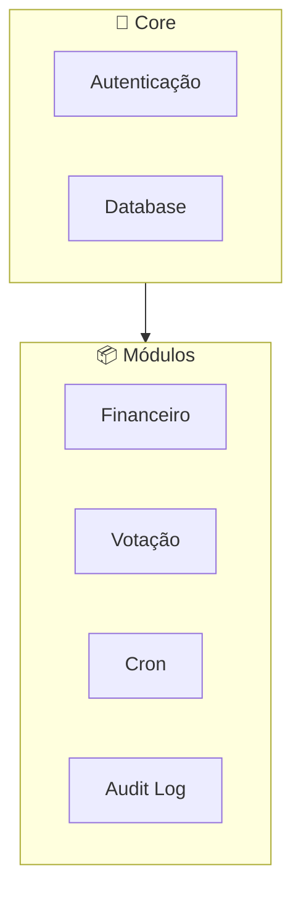
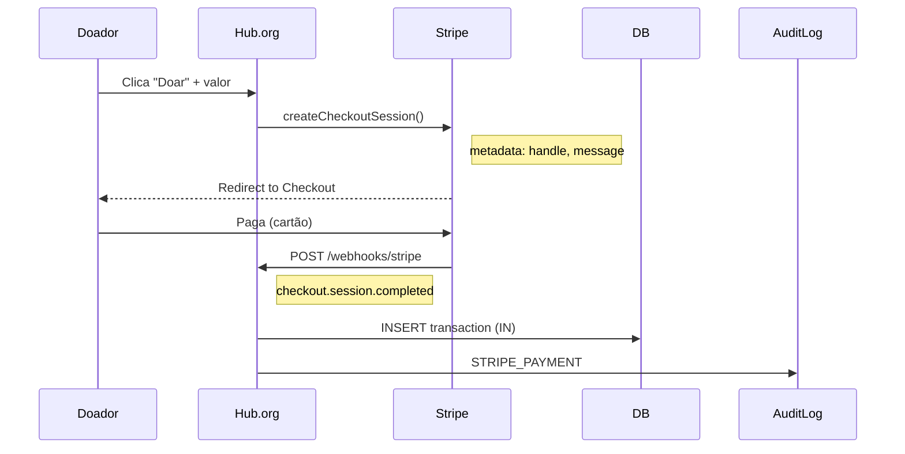
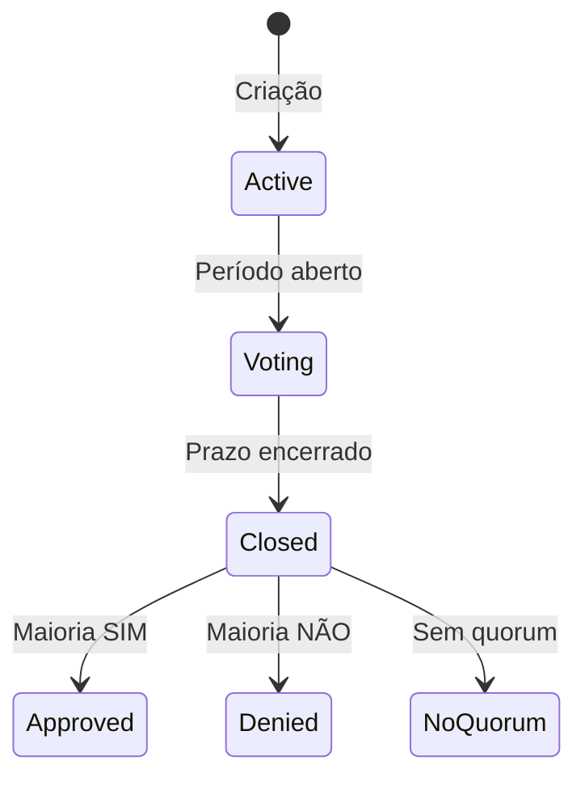
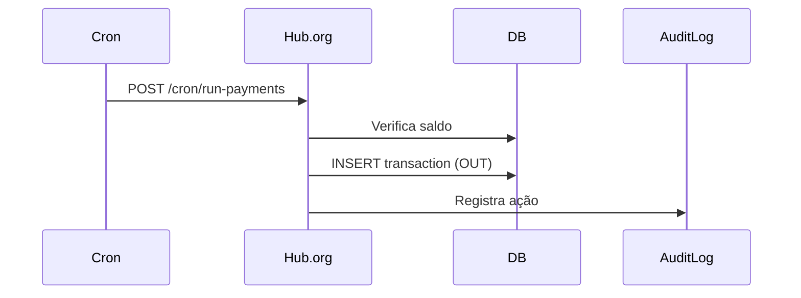
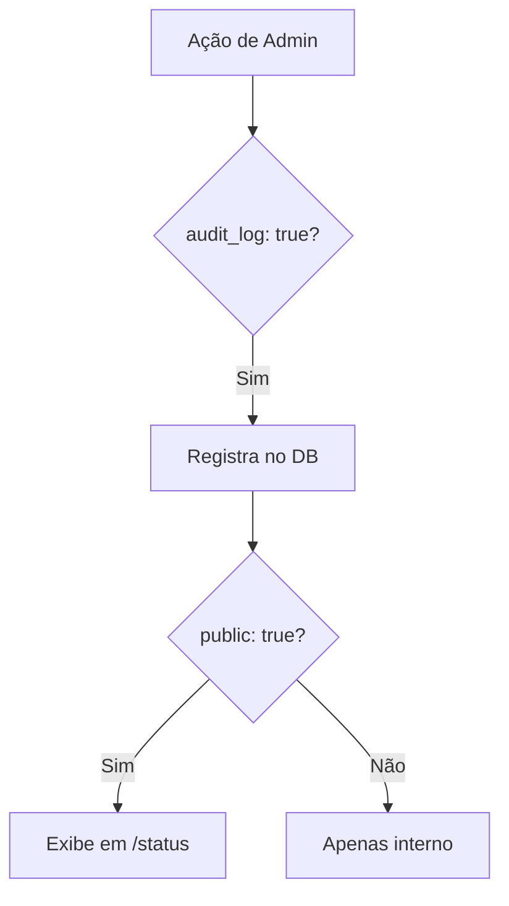
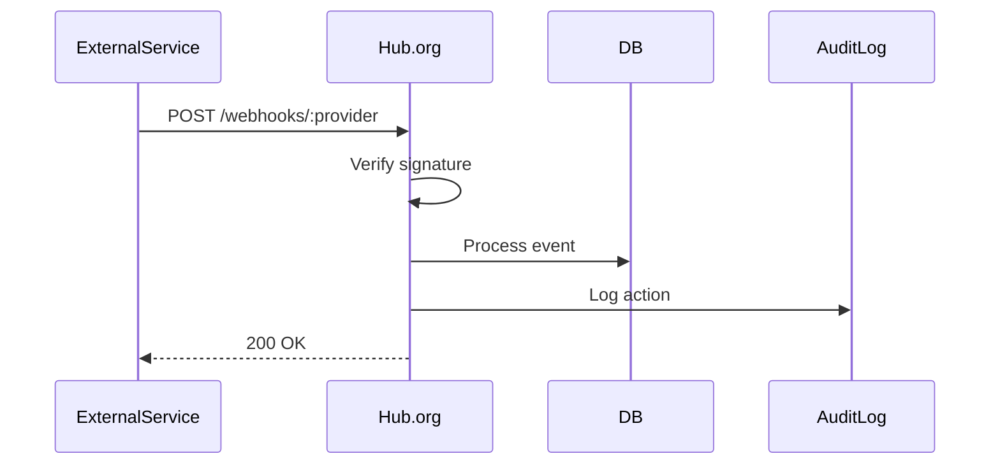

# Módulos do Sistema

> **Cada funcionalidade do Hub.org é um módulo independente e configurável.**

---

## Arquitetura Modular



---

## 1. Módulo Financeiro

Gerencia doações, gastos e metas de arrecadação.

### Fluxo de Doação via Stripe Checkout



### Implementação

```javascript
// stripeService.js
const session = await stripe.checkout.sessions.create({
  mode: 'payment',
  line_items: [{ price_data: {...}, quantity: 1 }],
  metadata: { handle, message },
  success_url: '/donate/success',
  cancel_url: '/#donate',
});
```

**Webhook Handler:**

```javascript
// POST /webhooks/stripe
if (event.type === 'checkout.session.completed') {
  const { metadata, amount_total } = session;
  await createDonation({
    amount: amount_total / 100,
    donorHandle: metadata.handle,
    message: metadata.message,
  });
}
```

### Configurações

| Parâmetro            | Descrição                 |
| -------------------- | ------------------------- |
| `min_amount`         | Valor mínimo de doação    |
| `max_amount`         | Valor máximo              |
| `allow_anonymous`    | Permite doações sem login |
| `goal.enabled`       | Habilita barra de meta    |
| `goal.target_amount` | Valor alvo                |

### Variáveis de Ambiente

```bash
STRIPE_SECRET_KEY=sk_live_...
STRIPE_WEBHOOK_SECRET=whsec_...
STRIPE_PUBLISHABLE_KEY=pk_live_...
```

---

## 2. Módulo de Votação

Permite governança participativa com propostas e votos.

### Ciclo de Vida



### Pay-to-Create

Cria barreira de entrada para evitar spam:

```javascript
if (settings.pay_to_create.enabled) {
  // Cobra taxa para criar proposta
  await chargeCreationFee(userHandle, settings.pay_to_create.amount);
}
```

**Benefícios:**

- Evita spam de propostas
- Demonstra comprometimento
- Gera receita para o projeto

### Pay-to-Vote

Opcionalmente, votar pode ter custo:

```javascript
if (settings.pay_to_vote.enabled) {
  await chargeVotingFee(userHandle, settings.pay_to_vote.amount);
}
```

**Quando usar:**

- DAOs com peso financeiro
- Prevenção de ataques sybil

### Configurações

| Parâmetro              | Descrição                      |
| ---------------------- | ------------------------------ |
| `pay_to_create.amount` | Taxa para criar proposta       |
| `pay_to_vote.amount`   | Taxa para votar (0 = gratuito) |
| `quorum.min_votes`     | Votos mínimos para validar     |
| `duration_days`        | Duração da votação             |

---

## 3. Módulo Cron/Automação

Automatiza pagamentos recorrentes de infraestrutura.

### Fluxo de Pagamento Automático



### Configuração de Pagamentos

```json
{
  "auto_payments": {
    "payments": [
      {
        "id": "hosting",
        "description": "Servidor DigitalOcean",
        "amount": 24.0,
        "currency": "USD",
        "recipient": "DigitalOcean"
      }
    ]
  }
}
```

### Registro Público

Pagamentos automáticos são exibidos com ícone 🤖:

```
📤 Saídas Automáticas - Janeiro 2024
01/01 | Servidor DigitalOcean | -$24.00  🤖
```

---

## 4. Módulo de Transparência (Audit Log)

Registra ações administrativas para auditoria pública.

### Lógica



### Ações Auditáveis

| Ação             | Código               | Descrição                |
| ---------------- | -------------------- | ------------------------ |
| Banir Usuário    | `BAN_USER`           | Admin baniu @handle      |
| Desbanir         | `UNBAN_USER`         | Admin desbaniu @handle   |
| Deletar Proposta | `DELETE_PROPOSAL`    | Admin removeu proposta   |
| Editar Proposta  | `EDIT_PROPOSAL`      | Admin modificou proposta |
| Cancelar Votação | `CANCEL_VOTE`        | Admin cancelou votação   |
| Reembolsar       | `REFUND_TRANSACTION` | Reembolso processado     |
| Alterar Config   | `CHANGE_SETTINGS`    | Config alterada          |

### Página `/status`

Quando `audit_log.public: true`:

```
📋 Log de Transparência

🕐 Hoje, 14:32
  🚫 BAN_USER
  Admin: @mantenedor
  Alvo: @usuario_spam
  Motivo: "Spam repetido"

🕐 Ontem, 09:15
  ⚙️ CHANGE_SETTINGS
  Admin: @fundador
  Alteração: min_donation: 5 → 10
```

### Implementação

```javascript
// src/services/audit.js
async log({ action, adminHandle, target, details }) {
  if (!config.audit_log.enabled) return;
  if (!config.audit_log.actions_to_log.includes(action)) return;

  await db.insert('audit_logs', {
    action,
    admin_handle: adminHandle,
    target,
    details: JSON.stringify(details),
    timestamp: new Date(),
    public: config.audit_log.public
  });
}
```

---

## 5. Módulo de Webhooks

Recebe notificações externas de provedores (Stripe, GitHub, etc.) para automações.

### Fluxo de Webhook



### Provedores Suportados

| Provider | Endpoint            | Eventos                    |
| -------- | ------------------- | -------------------------- |
| Stripe   | `/webhooks/stripe`  | `payment_intent.succeeded` |
| GitHub   | `/webhooks/github`  | `release.published`        |
| Generic  | `/webhooks/generic` | Customizável               |

### Exemplo: Doação via Stripe

```json
// POST /webhooks/stripe
{
  "type": "payment_intent.succeeded",
  "data": {
    "object": {
      "id": "pi_xxx",
      "amount": 5000,
      "description": "Doação via Stripe"
    }
  }
}
```

**Resultado:**

- Transação de entrada registrada
- Audit log atualizado
- Dashboard reflete novo saldo

---

## 6. Módulo de Exportação e Backup

Permite que o administrador baixe uma cópia completa e configurada do projeto para hospedagem independente.

### Funcionalidades:

- **Configuração Visual**: Personalização de nome, descrição, cores e logo antes do download.
- **Segurança**: Geração automática de chaves secretas (SESSION_SECRET) e limpeza de dados sensíveis.
- **Portabilidade**: Entrega um arquivo `.zip` pronto para deploy com `npm start`.

### Fluxo:

1. Admin acessa `/admin/export`.
2. Preenche formulário de configuração.
3. Sistema gera novo `modules.json` e `.env`.
4. Sistema compacta código-fonte e assets.
5. Admin inicia download.

---

## 7. Sistema de Blog / Atualizações

Canal oficial de comunicação do projeto com a comunidade.

- **Tipos de Posts**:
  - `DONE` (Concluído - Verde)
  - `IN_PROGRESS` (Em Progresso - Amarelo)
  - `PLANNED` (Planejado - Azul)
- **Engajamento**: Sistema de comentários integrado (com suporte a restrição "Pay-to-Comment").

---

## 8. Gestão de Usuários (Admin)

Painel para controle da base de usuários.

- **Promoção**: Transformar usuários em Admins.
- **Banimento**: Suspender acesso de usuários mal-intencionados.
- **Visualização**: Listagem com status, role e data de registro.

---

## 9. Módulo de Doações e Recompensas

Sistema completo para arrecadação de fundos com suporte a pagamentos manuais e automáticos.

- **Pagamento Manual (Pix)**: Upload de comprovante, validação manual por admin.
- **Pagamento Automático**: Integração Stripe (Cards, Boleto).
- **Gamificação**: Sistema de badges (tags) baseado no total doado pelo usuário.
  - Ex: R$ 50 = "Supporter", R$ 500 = "VIP".
- **Privacidade**: Opção de doação anônima.

---

## 10. Módulo de Integrações

Conecta o Hub.org a serviços de comunicação externos.

- **Email (SMTP)**:
  - Envio de Magic Links para login.
  - Notificações de sistema.
  - Configurável via Admin.
- **WhatsApp (Meta Cloud API)**:
  - Integração oficial.
  - Login e notificações via WhatsApp.
  - Opção "WhatsApp Obrigatório" para garantir identidade real.

---

## 11. Atualizador de Sistema

Ferramenta interna para manter o Hub.org seguro e atualizado.

- **Verificação de Versão**: Compara versão local (`package.json`) com tags do GitHub.
- **Backup Automático**: Realiza backup antes de qualquer operação crítica.
- **One-Click Update**: Executa `git pull` e `npm install` diretamente do painel administrativo.
