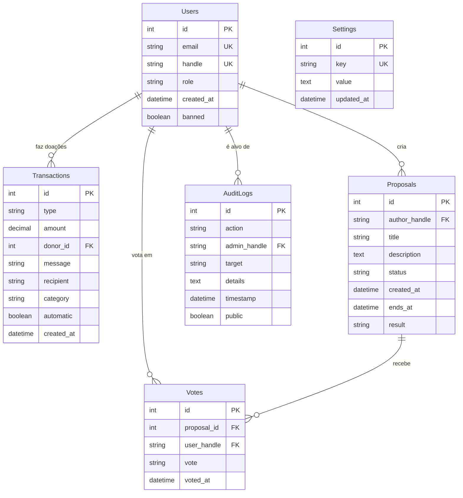

# Banco de Dados

> **Schema do Hub.org usando SQLite como padrão, com suporte a drivers externos.**

---

## Diagrama ER



---

## Schema SQL

### Tabela: Users

```sql
CREATE TABLE users (
    id INTEGER PRIMARY KEY AUTOINCREMENT,
    email TEXT UNIQUE NOT NULL,
    handle TEXT UNIQUE NOT NULL,
    role TEXT DEFAULT 'user' CHECK (role IN ('user', 'admin')),
    created_at DATETIME DEFAULT CURRENT_TIMESTAMP,
    banned INTEGER DEFAULT 0,
    banned_at DATETIME,
    banned_reason TEXT
);

CREATE INDEX idx_users_email ON users(email);
CREATE INDEX idx_users_handle ON users(handle);
```

**Campos:**
| Campo | Tipo | Descrição |
|-------|------|-----------|
| `id` | INTEGER | Identificador único |
| `email` | TEXT | Email (usado para auth, nunca exposto) |
| `handle` | TEXT | @handle único público |
| `role` | TEXT | 'user' ou 'admin' |
| `banned` | INTEGER | 0 = ativo, 1 = banido |

---

### Tabela: Transactions

```sql
CREATE TABLE transactions (
    id INTEGER PRIMARY KEY AUTOINCREMENT,
    type TEXT NOT NULL CHECK (type IN ('IN', 'OUT')),
    amount DECIMAL(10,2) NOT NULL,
    currency TEXT DEFAULT 'BRL',
    donor_id INTEGER REFERENCES users(id),
    donor_handle TEXT,
    message TEXT,
    recipient TEXT,
    description TEXT,
    category TEXT,
    automatic INTEGER DEFAULT 0,
    external_id TEXT,
    created_at DATETIME DEFAULT CURRENT_TIMESTAMP
);

CREATE INDEX idx_transactions_type ON transactions(type);
CREATE INDEX idx_transactions_created ON transactions(created_at DESC);
```

**Campos:**
| Campo | Tipo | Descrição |
|-------|------|-----------|
| `type` | TEXT | 'IN' (entrada) ou 'OUT' (saída) |
| `amount` | DECIMAL | Valor da transação |
| `donor_id` | INTEGER | FK para users (doações) |
| `donor_handle` | TEXT | @handle do doador (cache) |
| `message` | TEXT | Mensagem opcional do doador |
| `recipient` | TEXT | Destinatário (para saídas) |
| `category` | TEXT | 'infrastructure', 'service', etc |
| `automatic` | INTEGER | 1 = pagamento automático (cron) |
| `external_id` | TEXT | ID do Stripe/PagSeguro |

---

### Tabela: Proposals

```sql
CREATE TABLE proposals (
    id INTEGER PRIMARY KEY AUTOINCREMENT,
    author_handle TEXT NOT NULL REFERENCES users(handle),
    title TEXT NOT NULL,
    description TEXT,
    status TEXT DEFAULT 'active' CHECK (
        status IN ('draft', 'active', 'voting', 'closed', 'cancelled')
    ),
    result TEXT CHECK (result IN ('approved', 'denied', 'no_quorum', NULL)),
    created_at DATETIME DEFAULT CURRENT_TIMESTAMP,
    ends_at DATETIME NOT NULL,
    closed_at DATETIME,
    yes_count INTEGER DEFAULT 0,
    no_count INTEGER DEFAULT 0,
    abstain_count INTEGER DEFAULT 0
);

CREATE INDEX idx_proposals_status ON proposals(status);
CREATE INDEX idx_proposals_ends ON proposals(ends_at);
```

---

### Tabela: Votes

```sql
CREATE TABLE votes (
    id INTEGER PRIMARY KEY AUTOINCREMENT,
    proposal_id INTEGER NOT NULL REFERENCES proposals(id),
    user_handle TEXT NOT NULL REFERENCES users(handle),
    vote TEXT NOT NULL CHECK (vote IN ('yes', 'no', 'abstain')),
    voted_at DATETIME DEFAULT CURRENT_TIMESTAMP,

    UNIQUE(proposal_id, user_handle)
);

CREATE INDEX idx_votes_proposal ON votes(proposal_id);
```

**Campos:**
| Campo | Tipo | Descrição |
|-------|------|-----------|
| `proposal_id` | INTEGER | FK para proposals |
| `user_handle` | TEXT | @handle do votante |
| `vote` | TEXT | 'yes', 'no', ou 'abstain' |

---

### Tabela: AuditLogs

```sql
CREATE TABLE audit_logs (
    id INTEGER PRIMARY KEY AUTOINCREMENT,
    action TEXT NOT NULL,
    admin_handle TEXT NOT NULL,
    target TEXT,
    details TEXT,
    timestamp DATETIME DEFAULT CURRENT_TIMESTAMP,
    public INTEGER DEFAULT 1
);

CREATE INDEX idx_audit_timestamp ON audit_logs(timestamp DESC);
CREATE INDEX idx_audit_action ON audit_logs(action);
```

**Ações registradas:**

- `BAN_USER`, `UNBAN_USER`
- `DELETE_PROPOSAL`, `EDIT_PROPOSAL`, `CANCEL_VOTE`
- `REFUND_TRANSACTION`
- `CHANGE_SETTINGS`
- `AUTO_PAYMENT`

---

### Tabela: Settings (Opcional)

```sql
CREATE TABLE settings (
    id INTEGER PRIMARY KEY AUTOINCREMENT,
    key TEXT UNIQUE NOT NULL,
    value TEXT NOT NULL,
    updated_at DATETIME DEFAULT CURRENT_TIMESTAMP,
    updated_by TEXT
);
```

Backup das configurações do `modules.json` para histórico.

---

## Schema Prisma (Alternativo)

```prisma
// prisma/schema.prisma

generator client {
  provider = "prisma-client-js"
}

datasource db {
  provider = "sqlite"
  url      = env("DATABASE_URL")
}

model User {
  id          Int           @id @default(autoincrement())
  email       String        @unique
  handle      String        @unique
  role        String        @default("user")
  createdAt   DateTime      @default(now())
  banned      Boolean       @default(false)
  bannedAt    DateTime?
  bannedReason String?

  transactions Transaction[]
  votes        Vote[]
  proposals    Proposal[]
}

model Transaction {
  id          Int       @id @default(autoincrement())
  type        String    // IN | OUT
  amount      Decimal
  currency    String    @default("BRL")
  donorId     Int?
  donor       User?     @relation(fields: [donorId], references: [id])
  donorHandle String?
  message     String?
  recipient   String?
  description String?
  category    String?
  automatic   Boolean   @default(false)
  externalId  String?
  createdAt   DateTime  @default(now())
}

model Proposal {
  id           Int       @id @default(autoincrement())
  authorHandle String
  author       User      @relation(fields: [authorHandle], references: [handle])
  title        String
  description  String?
  status       String    @default("active")
  result       String?
  createdAt    DateTime  @default(now())
  endsAt       DateTime
  closedAt     DateTime?
  yesCount     Int       @default(0)
  noCount      Int       @default(0)
  abstainCount Int       @default(0)

  votes        Vote[]
}

model Vote {
  id         Int      @id @default(autoincrement())
  proposalId Int
  proposal   Proposal @relation(fields: [proposalId], references: [id])
  userHandle String
  user       User     @relation(fields: [userHandle], references: [handle])
  vote       String   // yes | no | abstain
  votedAt    DateTime @default(now())

  @@unique([proposalId, userHandle])
}

model AuditLog {
  id          Int      @id @default(autoincrement())
  action      String
  adminHandle String
  target      String?
  details     String?
  timestamp   DateTime @default(now())
  public      Boolean  @default(true)
}

model Setting {
  id        Int      @id @default(autoincrement())
  key       String   @unique
  value     String
  updatedAt DateTime @default(now())
  updatedBy String?
}
```

---

## Migrações

### Estrutura de Arquivos

```
src/db/
├── schema.sql          # DDL completo
├── migrations/
│   ├── 001_initial.sql
│   ├── 002_add_proposals.sql
│   └── 003_add_audit.sql
└── queries.js          # Queries preparadas
```

### Exemplo de Migração

```sql
-- migrations/001_initial.sql
-- Criação inicial do banco

BEGIN TRANSACTION;

CREATE TABLE IF NOT EXISTS users (...);
CREATE TABLE IF NOT EXISTS transactions (...);

COMMIT;
```

---

## Queries Comuns

```javascript
// src/db/queries.js

export const queries = {
  // Usuários
  getUserByEmail: `SELECT * FROM users WHERE email = ?`,
  getUserByHandle: `SELECT * FROM users WHERE handle = ?`,

  // Transações
  getRecentTransactions: `
    SELECT * FROM transactions 
    ORDER BY created_at DESC 
    LIMIT ?
  `,
  getTotalByType: `
    SELECT type, SUM(amount) as total 
    FROM transactions 
    GROUP BY type
  `,

  // Votações
  getActiveProposals: `
    SELECT * FROM proposals 
    WHERE status = 'active' 
    AND ends_at > datetime('now')
  `,

  // Audit
  getPublicAuditLogs: `
    SELECT * FROM audit_logs 
    WHERE public = 1 
    ORDER BY timestamp DESC 
    LIMIT ?
  `,
};
```

---

## Backup

### SQLite

```bash
# Backup simples
cp data/hub.db backups/hub_$(date +%Y%m%d).db

# Backup com sqlite3
sqlite3 data/hub.db ".backup 'backups/hub.db'"
```

### Automatizado (via Cron)

```javascript
// modules/cron/backup.js
import { copyFileSync } from "fs";

export async function backupDatabase() {
  const timestamp = new Date().toISOString().split("T")[0];
  const source = "./data/hub.db";
  const dest = `./data/backups/hub_${timestamp}.db`;

  copyFileSync(source, dest);
  console.log(`✅ Backup criado: ${dest}`);
}
```

---

<p align="center">
  <strong>Hub.org</strong> — Database schema v1.0
</p>
